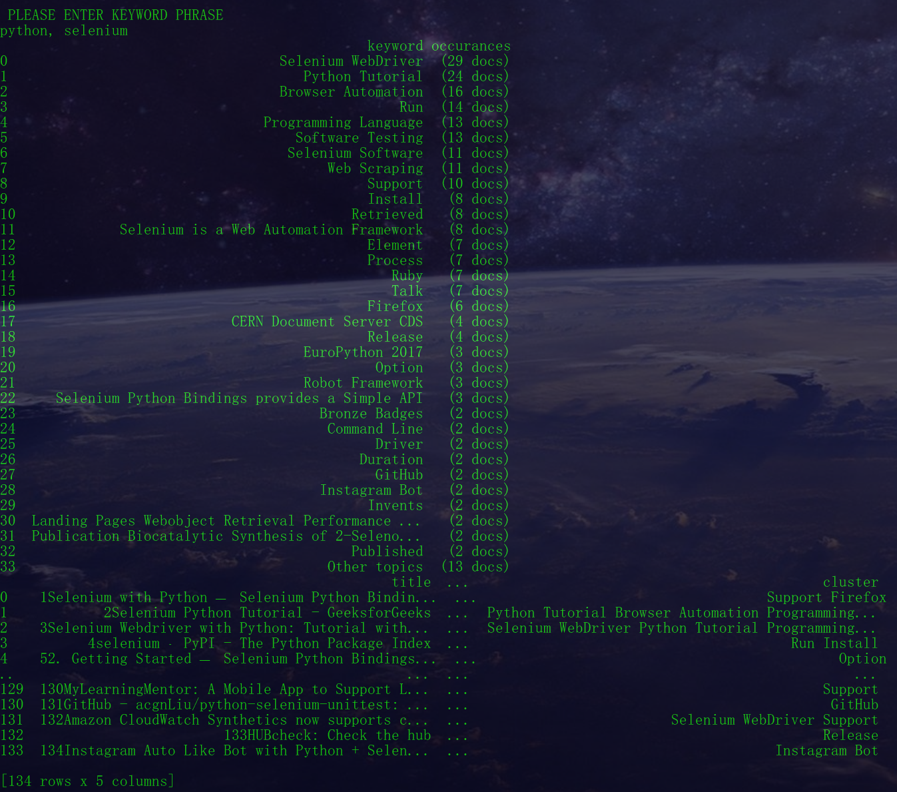
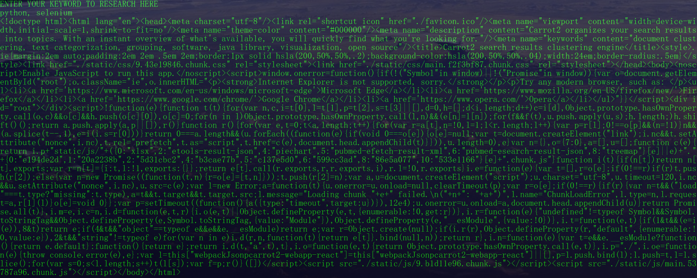

# Programmatically Data Mining G2's Carrot Search Tool for Keyword Insight
> Scrape Carrot Search using Selenium for keyword research and corpus gathering



## Background
Folks across the globe want textual information. Carrot2 is a tool that clusters search results from search engines. Using the Java programming language, this tool's algorithm is able to return clustered search results via a [browser](https://search.carrot2.org/#/search/web/carrot2/folders) or [public API](https://get.carrotsearch.com/circles/latest/api/).  

Business intelligence enthusiasts coding in Python may find use for this kind of clustered keyword results. Whether you want to gather a list of related keywords for a given search term or collect a corpus of text via URL sources, Carrot2 has a robust and accessible tool to access.

Because I am not familiar with the Java programming language, I have built a command line tool written in Python to return clustered keyword and corpus results for a given search term input. By sending a request to the browser version of Carrot2's search tool, we can programmatically access their clustered results.

This application is a great first step in collecting keyword relations and online sources for a keyword you are interested in. 

## A Note on Accessing Data
Using python, we want to load Carrot Search's website and collect the structured elements on the page. Python's requests package is a great library for requesting textual data on a web page. Sending a request to Carrot's result page using requests returns a page source heavy in Javascript and absent of keyword results. 



Let's work around this by using a headless browser to load Carrot2's online UI. Selenium will do nicely.

## Setup
* Familiarize yourself with [Selenium with Python](https://selenium-python.readthedocs.io/)
* Download a Driver
    * [Chrome](https://sites.google.com/a/chromium.org/chromedriver/downloads)
    * [Edge] 	(https://developer.microsoft.com/en-us/microsoft-edge/tools/webdriver/)
    * [Firefox](https://github.com/mozilla/geckodriver/releases)
    * [Safari](https://webkit.org/blog/6900/webdriver-support-in-safari-10/)
* Brainstorm what to research

## Execution
```sh
python selenium_carrot_scraper.py
```

After entering this command, a browser will open and research whatever keyword you enter in the terminal. 

The researched output will print to the terminal and save a 2 csv files in the /results folder. Keyword results will go into keyword_results.csv while source results will be written to keyword_source_results.csv.  

## Moving Forward
The results from this tool can be used in a variety of applications. From NLP, to Machine Learning, to Search Engine Optimization, there is a wide range of use. If you are interested in productionalizing this information for your personal or professional applications, feel free to reach out to me. 